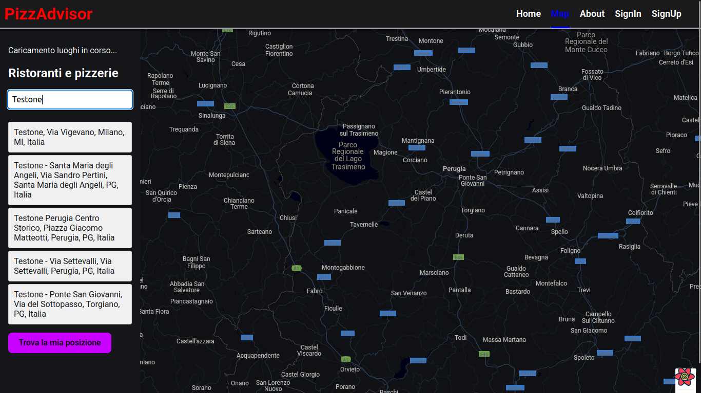
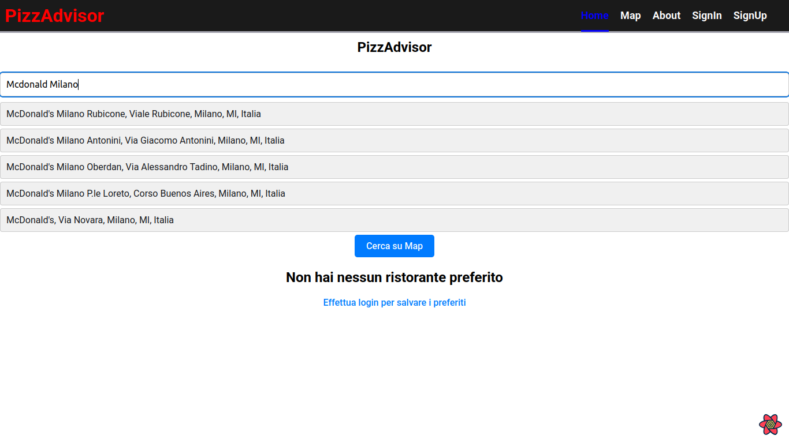
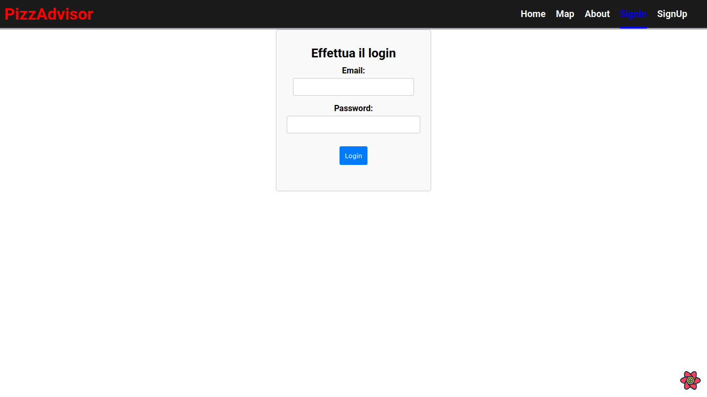

# PizzAdvisor Front-End
Sviluppato con React TypeScript (VITE)

## Screenshots


- Schermata mappa


- Schermata principale


- Schermata di login

## Link al Back-End
- https://github.com/Froggher/pizzadvisor-node-express

## Utilities e documentazione
### Metodo per aggiornare navBar
- https://stackoverflow.com/questions/56192101/react-refresh-component-on-login

### Libreria per combobox e altro
- https://mui.com/material-ui/react-autocomplete/#combo-box

- ### Ispirazione per le infobox
- https://github.com/evolaric/rgm-example/blob/fd5ee514a6213c5df49d532de0d3892e4409886e/src/InfoWindowComponent.js
https://codesandbox.io/s/react-google-mapsapi-multiple-markers-infowindow-h6vlq?file=/src/Map.js

### Implementazione tra react-query con typescript
- https://tkdodo.eu/blog/react-query-and-type-script

### Implementazione tra react-query e react-router
- https://tkdodo.eu/blog/react-query-meets-react-router

### Tutorial utili per typescript
https://marketsplash.com/tutorials/typescript/how-to-convert-react-js-to-typescript/
https://javascript.plainenglish.io/create-a-list-view-in-react-with-typescript-c598be1d0ff5
https://www.tutorialsteacher.com/typescript/converting-javascript-to-typescript

### Typescript unknown type
https://bobbyhadz.com/blog/typescript-check-if-unknown-has-property
https://medium.com/@vinhle95/the-unknown-type-in-typescript-939ec261294b

### React + TypeScript + Vite

This template provides a minimal setup to get React working in Vite with HMR and some ESLint rules.

Currently, two official plugins are available:

- [@vitejs/plugin-react](https://github.com/vitejs/vite-plugin-react/blob/main/packages/plugin-react/README.md) uses [Babel](https://babeljs.io/) for Fast Refresh
- [@vitejs/plugin-react-swc](https://github.com/vitejs/vite-plugin-react-swc) uses [SWC](https://swc.rs/) for Fast Refresh

### Expanding the ESLint configuration

If you are developing a production application, we recommend updating the configuration to enable type aware lint rules:

- Configure the top-level `parserOptions` property like this:

```js
   parserOptions: {
    ecmaVersion: 'latest',
    sourceType: 'module',
    project: ['./tsconfig.json', './tsconfig.node.json'],
    tsconfigRootDir: __dirname,
   },
```

- Replace `plugin:@typescript-eslint/recommended` to `plugin:@typescript-eslint/recommended-type-checked` or `plugin:@typescript-eslint/strict-type-checked`
- Optionally add `plugin:@typescript-eslint/stylistic-type-checked`
- Install [eslint-plugin-react](https://github.com/jsx-eslint/eslint-plugin-react) and add `plugin:react/recommended` & `plugin:react/jsx-runtime` to the `extends` list
